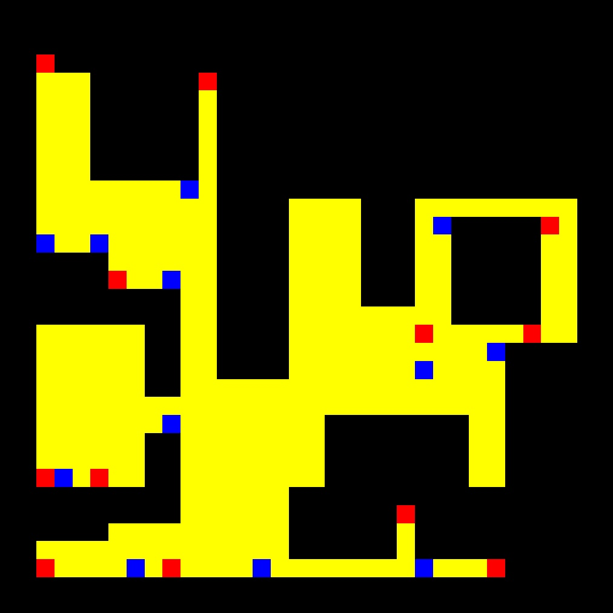

# P1 - Localized Vacuum Cleaner

**Date:** 12/10/2025

**Author:** Andrés Galea Torrecilla

## Algorithm details:
The goal is to program BSA algorithm for a localized vaccum cleaner so that it cleans as much of the map as possible.

### 0. Map Obstacles Dilatation:
Once the array map is obtained, and before performing any other operations, the obstacles are dilated using OpenCV's dilate function **(cv2.dilate)** with a **(9,9) kernel** and **2 iterations** (values determined after extensive testing) in order to ensure safer navigation.

### 1. Map Registration:
The objective of this phase is to optain an ecuation that allows coordiates transformation from:

- gazebo &rArr; pixel map
- pixel map &rArr; gazebo

To calculate the *gazebo &rArr; pixel map* transformation:
- Get 11 coordinates from gazebo and their corresponding coordinates in the pixel map.

- For every gazebo point and its corresponding pixel point, create the equations with these points and add them to A and B matrices.

- Use **np.linalg.lstsq(A,B)** to solve this system using the least squares method and get best transformation that approximates all those points as closely as possible.

To calculate the *pixel map &rArr; gazebo* transformation, assemble the resulting parameters into a matrix and invert it using **np.linalg.inv(t)**.

At the end of the phase, the transformation parameters for both directions (gazebo &rArr; pixel map and pixel map &rArr; gazebo) are available, and can be used with the following equations (note: *gazebo &rArr; pixel map* pixel coordinates must be rounded):

- x' = a·x + b·y + e

- y' = c·x + d·y + f

### 2. Navigation Grid Creation
To create the navigation grid, two key structures are used:

- **grid_map:** a 2D array that stores the state of each grid cell, indicating whether it is free or an obstacle.

- **centers:** a 3D array that stores the pixel coordinates of the center of each grid cell.

The grid is constructed by iterating over the image (with already dilated obstacles) in steps of GRID_SIZE, dividing it into grid cells of size *GRID_SIZE × GRID_SIZE (30×30 pixels in my case)*.

For each cell:

- The corresponding pixels are checked. If any of them represent an obstacle, the entire cell is marked as an obstacle in grid_map.

- The pixel coordinates of the cell's center are computed and stored in the centers array.

### 3. BSA Coverage Algorithm Route Planning
To create the navigation grid, two key structures are used:
- **route:** stores the route in *grid_map* coordinates.

- **return_points:** stores available return points, used to backtrack from critical points during the exploration.

Colour scheme chosen:
- **WHITE (white):** free grid cells that has not been involved in the planification yet.

- **DIRTY (yellow):** explored grid cells, considered as obstacles from now on (only available in routes to return points).

- **CRITICAL (red):** DIRTY grid cells which are critical points (no DIRTY neighbors available).

- **RETURN (blue):** DIRTY grid cells which in addition are return points.

The process begins at the robot’s initial location and continues until there are no **WHITE** cells left in the grid. It consists of the following steps:

- The robot current position is marked as **DIRTY** and attempts to explore neighboring **WHITE** cells using the following priority order:
  1. North neighbor
  2. East neighbor
  3. South neighbor
  4. West neighbor

- When a direction is chosen, the other **WHITE** (only free) neighbors are added to **return_points**, making them potential candidates for backtracking in case a dead-end (critical point) is reached.

- When a critical point is found:
  1. the grid cell si marked as **CRITICAL** (red).
  2. **return_points** is sorted based on Manhattan distance from the current position, so that the closest return point is tried first.
  3. a **BFS** (Breadth-First Search) is used to compute a path to the selected return point.
  4. the path is added to **route**.
  5. the return point is marked as **RETURN** (blue) and deleted from **return_points**.
  6. exploration continues from the return point.

### 4. Route Reactive Piloting

Reactive navigation is based on a proportional controller for both linear and angular velocity.
- The linear velocity is proportional to the Euclidean distance to the target.

- The angular velocity is proportional to the orientation error, which is normalized within the range [–π, π].

The navigation process continues as long as there are target points available. Once a target point is reached, it is marked as **CLEANED** and the next target point is selected.

To determine whether a point has been reached, the distance error is evaluated. If it is lower or equal to a predefined threshold, the point is considered reached (this threshold helps to avoid oscillations near the target).

During navigation:

- If the orientation error is below its corresponding threshold, the robot moves forward while simultaneously correcting its orientation.

- If the orientation error exceeds the threshold, the robot stops moving forward and focuses only on correcting orientation before moving forward again in order to avoid collisions.

### Obtained results:
The vacuum cleaner manages to clean a large area of the environment, successfully avoiding obstacles even though I have prioritised safety over obstacles rather than maximising the area cleaned.

<figure>
  
  <figcaption><em> BSA planification result image</em></figcaption>
</figure>

## Difficulties:

While developing the algorithm I found some difficulties:
- Finding the best ecuation so that the error between the current and the estimate location is low enough.

- Making the obstacles big enough so that the robot avoids them the best way possible, but without losing too much ground to clear.

- Resizing the grid_map so that it can be displayed correctly in an appropiate resolution. I crated a function to do so using **cv2.resize** with **interpolation=cv2.INTER_NEAREST** to resize it to the same size as the original image map has.

- Choose appropriate error thresholds for navigation so that the robot does not oscillate or collide with walls. I performed several tests to determine the best values.

## Execution video:

